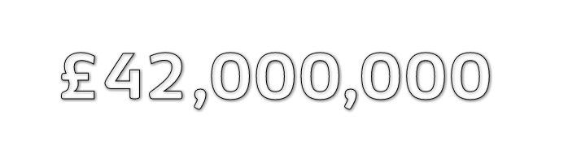

<p align="center">
  
</p>
<p align="center" style="font-size: 1.2rem;">SVG library for transitioning numbers with motion blur</p>

[](https://www.npmjs.com/package/bounty)
[](https://david-dm.org/coderitual/bounty)
[](https://www.npmjs.com/package/bounty)

> JavaScript odometer or slot machine effect library for smoothly transitioning numbers with motion blur. Library uses functional approach and ES7 Function Bind Syntax. Internally based on SVG.

<p align="center"></p>

See the **[live version](https://coderitual.github.io/bounty/examples/)**.

## Installation

To install the stable version:

`npm install --save bounty`

## Examples

The API is really simple and straigthforward:

```js
import bounty from `bounty`;

bounty({ el: '.js-bounty', value: '£42,000,000' });
```

You can use it with other **options**:

```js
import bounty from `bounty`;

bounty({
  el: '.js-bounty',
  value: '£42,000,000',
  initialValue: '£900,000',
  lineHeight: 1.35,
  letterSpacing: 1,
  animationDelay: 100,
  letterAnimationDelay: 100,
  duration: 3000
});
```

If you want to **control** ongoing animation just use methods from returned object:

```js
import bounty from `bounty`;

const { cancel, pause, resume } = bounty({ el: '.js-bounty', value: '£42,000,000' });

const wait = (delay) => new Promise((resolve) => setTimeout(resolve, delay));

const pasueAndRun = async () => {
  await wait(1500);
  pause();
  await wait(2000);
  resume();
  await wait(2000);
  cancel();
};

pasueAndRun();
```

Library is built using UMD thus the following usage in HTML is possible.

```html
<div class="js-bounty"></div>
<script src="/bounty.js"></script>
<script>
  bounty.default({ el: ".js-bounty", value: "£42,000,000" });
</script>
```

The UMD build is also available on unpkg:

```html
<script src="https://unpkg.com/bounty@1.1.6/lib/bounty.js"></script>
```

You can find the library on `window.bounty`.

## That's it?

Yea! That's it. Other options like `font-family` and `font-size` are taken from **computed styles** so you can just style it like the other layers.

```css
.js-bounty {
  font-size: 60px;
  font-family: Roboto;
  fill: #fff;
  text-shadow: 1px 1px 5px rgba(0, 0, 0, 0.5);
}
```

## How?

If you're interested how it's made, see the **[presentation](http://slides.com/coderitual/odoo-js)**.

## Roadmap

There is a work in progress to implement additional features:

- [ ] `from` `to` API.
- [ ] Full ASCII transition support.
- [ ] Control animation.
- [ ] Introduce Webcomponents API `<svg-bounty>`

<p align="center"></p>

## License

The library is available under the MIT license. For more info, see the [LICENSE](LICENSE) file.
